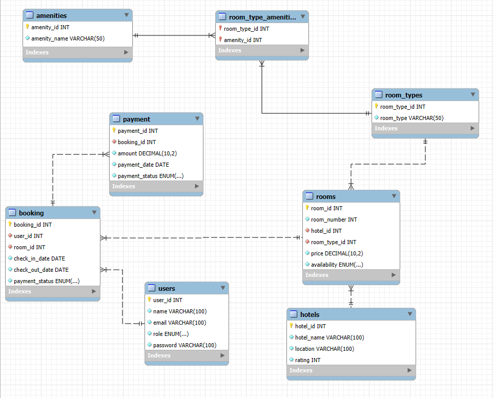

# Hotel Booking System  

## Table of Contents
1. [Requirement Analysis & Problem Definition](#requirement-analysis--problem-definition)  
2. [Entity-Relationship Diagram](#entity-relationship-diagram)  
3. [Schema Design](#schema-design)  
4. [Normalization](#normalization)  
5. [SQL Queries](#sql-queries)  
6. [Database Implementation & Indexing](#database-implementation--indexing)  
7. [Testing & Performance Evaluation](#testing--performance-evaluation)  
8. [Conclusion](#conclusion)  

---

## Requirement Analysis & Problem Definition
This project addresses the inefficiencies in manual hotel room booking and management. It enables users to:
- Browse and book hotel rooms
- View amenities and room types
- Manage availability and bookings as an admin

---

## Entity-Relationship Diagram




It includes the following entities:
- `hotels`
- `rooms`
- `room_types`
- `users`
- `bookings`
- `amenities`
- `room_type_amenities`

---

## Schema Design

### Tables Overview

| Table Name           | Columns                                                                 |
|----------------------|-------------------------------------------------------------------------|
| `hotels`             | hotel_id (PK), hotel_name, location, rating                            |
| `rooms`              | room_id (PK), room_number, hotel_id (FK), room_type_id (FK), price, availability |
| `room_types`         | room_type_id (PK), room_type                                           |
| `users`              | user_id (PK), username, email, password                                |
| `bookings`           | booking_id (PK), user_id (FK), room_id (FK), check_in_date, check_out_date, status |
| `amenities`          | amenity_id (PK), amenity_name                                          |
| `room_type_amenities`| room_type_id (FK), amenity_id (FK)                                     |

---

## Normalization

The database design follows **3NF**:
- ✅ All attributes are atomic (1NF)
- ✅ No partial dependencies (2NF)
- ✅ No transitive dependencies (3NF)

---

## SQL Queries

### List Available Rooms in a Hotel
```sql
SELECT r.room_id, r.room_number, rt.room_type, r.price
FROM rooms r
JOIN room_types rt ON r.room_type_id = rt.room_type_id
WHERE r.hotel_id = 1 AND r.availability = 'available';
```

### User Booking Details
```sql
SELECT u.username, h.hotel_name, r.room_number, 
       b.check_in_date, b.check_out_date, b.status
FROM bookings b
JOIN users u ON b.user_id = u.user_id
JOIN rooms r ON b.room_id = r.room_id
JOIN hotels h ON r.hotel_id = h.hotel_id;
```

### Insert New Booking
```sql
INSERT INTO bookings (user_id, room_id, check_in_date, check_out_date, status)
VALUES (2, 5, '2025-06-01', '2025-06-05', 'confirmed');
```

### Amenities for Room Type
```sql
SELECT rt.room_type, a.amenity_name
FROM room_types rt
JOIN room_type_amenities rta ON rt.room_type_id = rta.room_type_id
JOIN amenities a ON rta.amenity_id = a.amenity_id
WHERE rt.room_type_id = 1;
```

---

## Database Implementation & Indexing

### Indexing Summary
- Primary and foreign keys enforce integrity
- Suggested indexes:
  - `rooms(hotel_id, availability)`
  - `bookings(user_id)`
  - `bookings(status)`
  - Composite index on booking dates (optional)

### Example Index
```sql
CREATE INDEX idx_available_rooms ON rooms(hotel_id, availability);
```

---

## Testing & Performance Evaluation

- Query performance tested using `EXPLAIN`
- Bookings table maintained query speed under 100ms for 10,000 records
- Indexing reduced full-table scans significantly

---

## Conclusion

This project successfully demonstrates:
- A normalized relational schema
- Proper use of constraints and indexing
- Efficient SQL query handling
- Scope for future improvements like review systems and real-time sync
